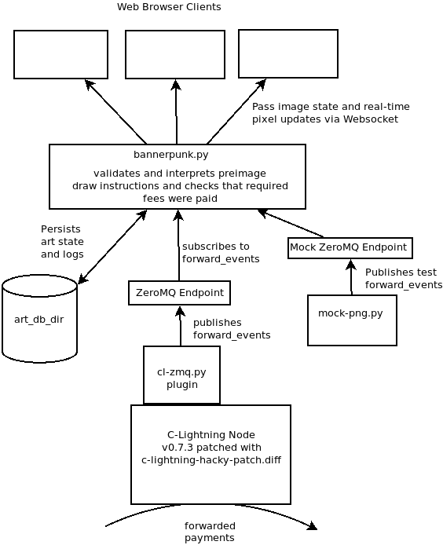

# BannerPunk

For an overall explanation [The Main Page](https://bannerpunk.biz) which is a deployed, running version of this project.

It explains how the pixel drawing messages are sent from a purchaser to a BannerPunk server via Lightning Network transactions.

# To Draw Pixels as a Client
The provided clients for [C-Lightning](c-lightning-draw.py) and [LND](lnd-draw.py) work with nearly-identical CLI interfaces. Both have `manual` mode and `png` mode. The c-lightning client depends on the official `pylightning` packages (`$ sudo pip3 install pylightning`)

## manual mode

```
$ ./lnd-draw.py manual -h
usage: lnd-draw.py manual [-h] lncli_executable image_no pixel [pixel ...]

positional arguments:
  lncli_executable  path to the lncli executable for interfacing with lnd
  image_no          image number to draw to (0, 1, or 2)
  pixel             a list of one, two, three or four pixels to draw in the
                    format x,y,rgb, eg. 10,20,44ffee

optional arguments:
  -h, --help        show this help message and exit
```

The `manual` mode will perform a single payment with 1, 2, 3 or 4 pixels encoded in a preimage. The image number must be chosen and the pixels must be within the dimensions, as is explained on the main page [the main page](https://bannerpunk.biz).

For LND, the path to the `lncli` binary that can talk to your local `lnd` node must be given as an arg. Eg.

`$ ./lnd-draw.py manual /path/to/lcli 0 5,5,ff0000 6,6,00ff00, 7,7,0000ff`

will pay 3 satoshis (plus additional routing fees) to draw three pixels on image 0 at the specified coordinates with the specified 24-bit hex colors.

For C-Lightning, the path to the `lightning-rpc` file must be given as an arg. Eg.

`$ ./c-lightning-draw.py manual /path/to/lightning-rpc 0 5,5,ff0000 6,6,00ff00, 7,7,0000ff`

will pay 3 satoshis to do the same.

## png mode

```
$ ./lnd-draw.py png -h
usage: lnd-draw.py png [-h]
                       lncli_executable image_no x_offset y_offset png_file

positional arguments:
  lncli_executable  path to the lncli executable for interfacing with lnd
  image_no          image number to draw to (0, 1, or 2)
  x_offset          the x coordinate to begin drawing at
  y_offset          the y coordinate to begin drawing at
  png_file          the path to the png file to use

optional arguments:
  -h, --help        show this help message and exit
```

The `png` mode of the scripts will take a PNG image file as an input and issue multiple payments to paint it on the banner image at chosen coordinates. It will pay 1 satoshi per pixel - so tiny images are better for testing.

Both scripts require the Python package `pillow` and dependencies for interpreting .png images:
`sudo apt-get install libopenjp2-7 libtiff5`
`sudo pip3 install pillow`

Eg.

`$ ./lnd-draw.py png /path/to/lcli 0 10 10 /path/to/chosen/image.png`

will draw the chosen .png image to image 0 with the upper-left corner placed at the 10,10 coordinate, *paying 1 satoshi per pixel*.

The equivalent for the c-lightning script is:

`$ ./c-lightning-draw.py png /path/to/lightning-rpc 0 10 10 /path/to/chosen/image.png`


# To Setup Your Own BannerPunk Server to Earn

## At a high level
The components are configured like this:



## Patch C-Lightning
You will need to be running C-Lightning v0.7.3 patched with [a minor hack applied](c-lightning-hacky-patch.diff) that we wrote. This patch makes available the preimage value of forwarded payments to the plugin infrastructure.

`$ git clone https://github.com/ElementsProject/lightning`
`$ cd lightning`
`$ git checkout v0.7.3`
`$ git apply /path/to/c-lightning-hack-patch.diff`
`$ ./configure`
`$ make`

## Boot with ZeroMQ plugin

The C-Lightning node will also need to be run with [this plugin](https://github.com/lightningd/plugins/pull/70) for publishing plugin notifications via ZeroMQ such that the BannerPunk server can get notice of forwarded payments. (this plugin was wlso written by us, eyeballs/test/review very much appreciated). We put a copy of this plugin in this repo [here](depends/cl-zmq.py)

To run the plugin, `cl-zmq.py` will need to be copied to the plugin directory. To configure publication of [`forward_event`](https://github.com/ElementsProject/lightning/blob/master/doc/PLUGINS.md#forward_event) notifications to a ZeroMQ, C-Lightning will need to be booted with the `--zmq-pub-forward-event` option added by the plugin.

Eg.

`./lightningd <other boot options> -zmq-pub-forward-event=tcp://127.0.0.1:5556`


## Run the BannerPunk server

The server listens on ZeroMQ endpoints and publishes the art images via websockets. It utilizes Twisted, Autobahn, and TxZMQ as dependencies.

`sudo pip3 install twisted txzmq autobahn`

The ZeroMQ and websocket connection points can be specified as boot args:

```
$ ./bannerpunk.py -h
usage: bannerpunk.py [-h] [-e ENDPOINT] [-m MOCK_ENDPOINT] [-w WEBSOCKET_PORT]
                     [-a ART_DB_DIR]

optional arguments:
  -h, --help            show this help message and exit
  -e ENDPOINT, --endpoint ENDPOINT
                        endpoint to subscribe to for zmq notifications from
                        c-lightning via cl-zmq.py plugin
  -m MOCK_ENDPOINT, --mock-endpoint MOCK_ENDPOINT
                        endpoint to subscribe to zmq notifcations from a test
                        script such as mock-png.py
  -w WEBSOCKET_PORT, --websocket-port WEBSOCKET_PORT
                        port to listen for incoming websocket connections
  -a ART_DB_DIR, --art-db-dir ART_DB_DIR
                        directory to save the image state and logs
```

The `ART_DB_DIR` should be a writable directory for BannerPunk to persist the state of the pixel grids. This allows the server to restart without resetting the art. It also logs all accepted preimages along with the timestamp received (such that a replay can be constructed later).

The `MOCK_ENDPOINT` is an additional ZeroMQ endpoint to subscribe on. It is intended to be used with the [provided test script](test/mock-png.py) for feeding it valid preimages without the presence of an operating C-Lightning node and without the need to pay in order to set the pixel state. This might also be useful for 'administering' a server to erase content if desired.
